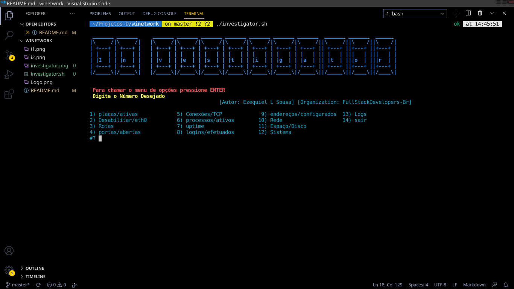
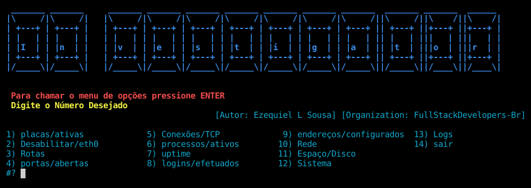

 Ferramenta para auxiliar na configuração e verificação de problemas na rede.

# Instalação 
<ol>
<li><code>git clone https://github.com/fullstackdevelopers-br/investigator.git</code></li>
<li><code>cd investigator</code></li>
<li><code>chmod a+x investigator.sh</code></li>
<li><code> ./investigator.sh </code></li>
</ol>

# :exclamation: Requirements
<ul>
<li>
Sistema Operacional Linux!
</li>
</ul>

# :exclamation: Warnning

Para que todas as opções funcionem corretamente, execute o comando com permissão de administrador. <strong>sudo</strong>.

